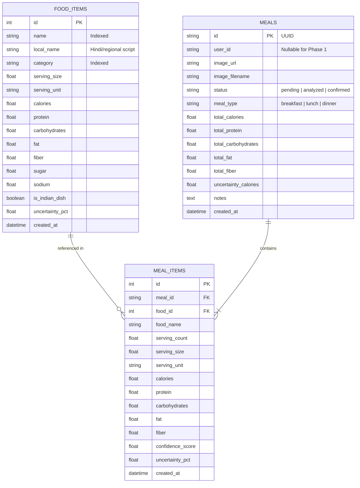

# NutriLens Architecture & Technical Specifications

## 1. System Vision & Engineering Philosophy

NutriLens is designed from first principles as an honest, credible **Nutrition Intelligence Platform** rather than a speculative "AI calorie estimator."

In existing consumer food apps, a recurring architectural flaw is prompting a Large Multimodal Model (LMM) with a food photo and asking it to output an arbitrary calorie count (e.g., *"Detected: 642 calories"*). This creates dangerous hallucination vulnerabilities, zero reproducibility, and no mechanism for error bounds.

### Core Architectural Principle: Decoupled Intelligence Layers

NutriLens separates the pipeline into four strictly isolated layers:

```
[ Food Photograph ]
        │
        ▼
┌──────────────────────────────────────────────┐
│ Layer 1: Computer Vision & Item Recognition   │  <-- Multimodal Vision / YOLO / PyTorch
│ Identifies candidate foods & bounding boxes  │      (Does NOT invent calorie values)
└──────────────────────┬───────────────────────┘
                       │ Detected Food Classes & Confidence Scores
                       ▼
┌──────────────────────────────────────────────┐
│ Layer 2: Volumetric & Portion Estimation     │  <-- Reference density & visual anchors
│ Estimates serving sizes; requests user audit │      (User can adjust portion multipliers)
└──────────────────────┬───────────────────────┘
                       │ Standardized Grams / Serving Counts
                       ▼
┌──────────────────────────────────────────────┐
│ Layer 3: Deterministic Nutrition Engine      │  <-- Mathematically exact calculation
│ Computes exact macros & Atwater distributions│      (Computes root-sum-square uncertainty)
└──────────────────────┬───────────────────────┘
                       │ Aggregated Nutrition Summary & Error Margins
                       ▼
┌──────────────────────────────────────────────┐
│ Layer 4: Goal-Based Recommendation Engine    │  <-- Contextual intelligence
│ Suggests portion changes & balanced swaps    │      (Explains scenarios transparently)
└──────────────────────────────────────────────┘
```

---

## 2. Mathematical Formulation of Portion Uncertainty

Cooked dishes, particularly in Indian cuisine, have inherent recipe-level variance due to:
- Oil absorption and tadka variations
- Gravy reduction and water evaporation
- Moisture content in curries and dal

NutriLens models this using statistical uncertainty propagation:

Let each detected food item $i \in \{1, \dots, N\}$ have:
- Base calorie value $C_i$
- Serving multiplier $s_i$
- Recipe variance ratio $\delta_i \in [0.05, 0.20]$ (e.g., 10% for curries, 5% for plain roti)

The deterministic energy contribution for item $i$ is:
$$E_i = C_i \cdot s_i$$

The standard uncertainty delta for item $i$ is:
$$\sigma_i = E_i \cdot \delta_i$$

Total meal energy is deterministic:
$$E_{\text{total}} = \sum_{i=1}^N E_i$$

For independent culinary variations across components in a meal, composite uncertainty is computed using the root-sum-square (RSS) model:
$$\sigma_{\text{composite}} = \sqrt{\sum_{i=1}^N \sigma_i^2}$$

The system reports:
$$\text{Estimated Range: } [E_{\text{total}} - \sigma_{\text{composite}}, E_{\text{total}} + \sigma_{\text{composite}}] \text{ kcal}$$

And renders:
$$\text{"Estimated: } \sim E_{\text{total}} \text{ kcal } (\pm \sigma_{\text{composite}} \text{ kcal)"}$$

---

## 3. Database Schema Design (PostgreSQL / SQLAlchemy)

### Entity-Relationship Architecture



---

## 4. Swappable AI Abstraction (`AIProvider`)

The AI vision interface is defined by the abstract base class `AIProvider` in `app/ai/base.py`:

```python
class AIProvider(ABC):
    @abstractmethod
    async def analyze_food_image(self, image_bytes: bytes, filename: str) -> AIAnalysisResult:
        ...

    @abstractmethod
    async def identify_food_items(self, image_bytes: bytes) -> List[DetectedItemCandidate]:
        ...

    @abstractmethod
    async def generate_meal_recommendations(self, meal_summary: Dict[str, Any], user_goal: str) -> List[AIRecommendation]:
        ...
```

In Phase 1, `PlaceholderAIProvider` fulfills this contract by returning structured status schemas without fabricating synthetic values. In Phase 2, providers such as `GeminiVisionAIProvider`, `YOLOv8FoodDetector`, or fine-tuned Hugging Face models can be plugged in by updating `AI_PROVIDER` in `.env` without modifying a single route or database model.
